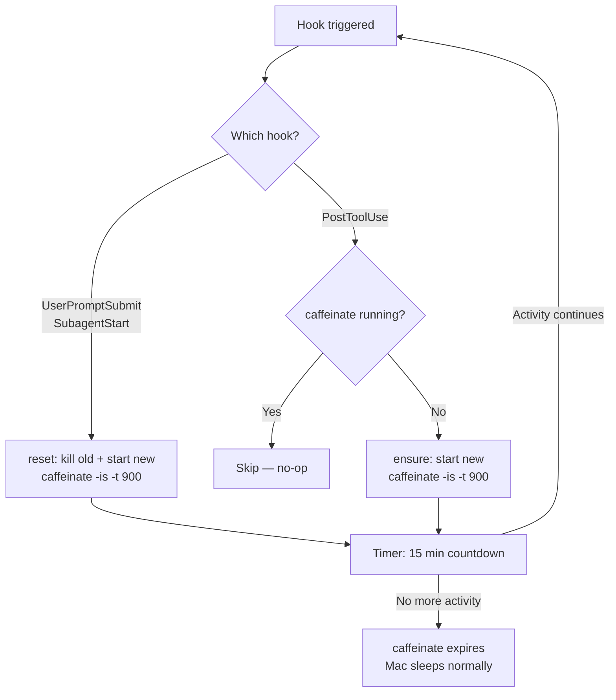
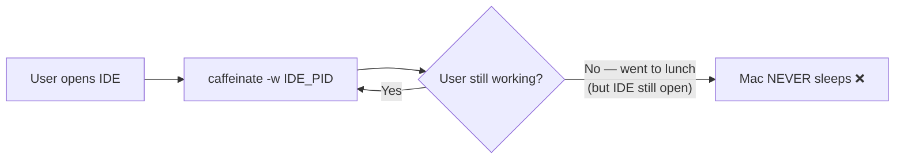
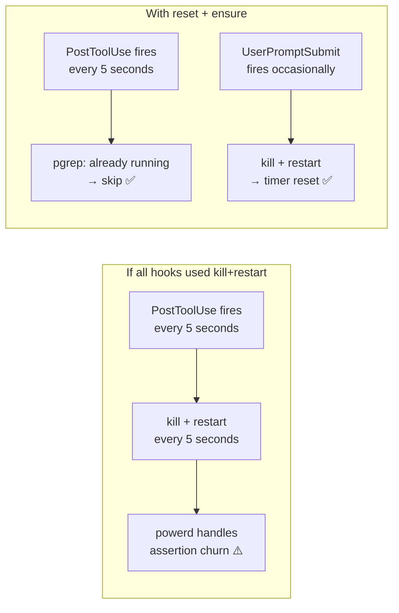
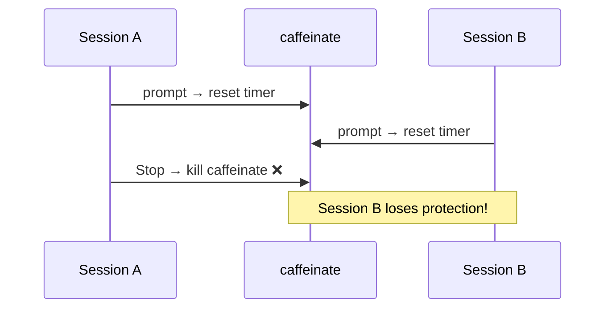

[中文](README.zh-CN.md) | English

# sip

Keep your Mac awake while AI works. ☕

A tiny [`caffeinate`](https://ss64.com/mac/caffeinate.html) wrapper for AI coding tools (Claude Code, Cursor, CodeBuddy, etc.). Every hook trigger "sips" a cup of coffee — resets a 15-minute caffeinate timer. When activity stops, Mac sleeps normally.

## Why

When Mac sleeps, **network connections drop** (Wi-Fi off, TCP broken), causing:
- AI tool sessions to **disconnect**
- Long-running tasks (multi-step refactors, parallel agents) to **fail mid-way**

`caffeinate -is` creates two power assertions:

| Assertion | Effect | Flag |
|---|---|---|
| `PreventUserIdleSystemSleep` | Prevents idle sleep | `-i` (battery + AC) |
| `PreventSystemSleep` | Prevents system sleep | `-s` (AC only) |

**Does not prevent display sleep** — your screen still turns off normally. Achieves "screen off, system awake".

## How it works



### Two hook strategies

| Strategy | Hooks | Behavior | Why |
|---|---|---|---|
| **reset** | `UserPromptSubmit`, `SubagentStart` | Kill + restart caffeinate | Low frequency. Resets the 15-min timer on each user prompt. |
| **ensure** | `PostToolUse` | Start only if not running | High frequency (fires every tool call). Avoids churning processes while guaranteeing coverage. |

This design means:
- **User keeps chatting** → `UserPromptSubmit` resets timer each time
- **AI runs a 45-min task** → `PostToolUse` ensures caffeinate is always present (restarts if expired mid-task)
- **All activity stops** → timer expires after 15 min, Mac sleeps

## Prerequisites

- macOS (uses native `caffeinate`)
- [`jq`](https://jqlang.org/) for install/uninstall only (`brew install jq`)
- An AI coding tool with hook support (e.g. [Claude Code](https://docs.anthropic.com/en/docs/claude-code))

## Quick start

**One-liner install** (recommended):

```bash
curl -fsSL https://raw.githubusercontent.com/wangyjstart/sip/main/sip.sh -o ~/.local/bin/sip.sh \
  && chmod +x ~/.local/bin/sip.sh \
  && ~/.local/bin/sip.sh install
```

Or clone and install:

```bash
git clone https://github.com/wangyjstart/sip.git && cd sip
./sip.sh install
```

Restart your IDE — done!

> **Note:** This is a personal fork of [tivnantu/sip](https://github.com/tivnantu/sip) that adds
> native Codex support. For the original (without Codex), use `tivnantu/sip`.

## Usage

```bash
sip.sh              # reset mode: kill + restart caffeinate (resets timer)
sip.sh ensure       # ensure mode: start only if not running
sip.sh status       # show installation and runtime status
sip.sh stop         # kill active caffeinate instance
sip.sh install      # install script and register hooks (auto-detect IDE)
sip.sh install --ide cursor   # install for specific IDE
sip.sh install --ide codex     # install for Codex (writes ~/.codex/hooks.json)
sip.sh uninstall    # remove hooks, stop caffeinate, remove script
sip.sh --help       # show help
```

### Supported IDEs

Default: auto-detect (first IDE whose config dir exists, fallback to claude). Use `--ide` to specify explicitly.

| IDE | `--ide` value |
|---|---|
| [Claude Code](https://docs.anthropic.com/en/docs/claude-code) | `claude` (fallback) |
| [CodeBuddy](https://www.codebuddy.ai/) | `codebuddy` |
| [WorkBuddy](https://www.workbuddy.ai/) | `workbuddy` |
| [Cursor](https://cursor.com/) | `cursor` |
| [Cline](https://docs.cline.bot/) | `cline` |
| [Augment](https://www.augmentcode.com/) | `augment` |
| [Windsurf](https://docs.windsurf.com/) | `windsurf` |
| [Codex](https://www.codex-docs.com/) | `codex` |

> **CodeBuddy vs WorkBuddy:** these are **separate** IDEs with separate config dirs.
> CodeBuddy reads `~/.codebuddy/settings.json`; WorkBuddy reads `~/.workbuddy/settings.json`
> (selected via the `WORKBUDDY_CONFIG_DIR` env var). Run `--ide codebuddy` **and**
> `--ide workbuddy` separately if you use both.
>
> **Codex note:** hooks are written to `~/.codex/hooks.json` (not `settings.json`).
> Codex requires non-managed hooks to be trusted once — after install, run `/hooks` in Codex
> and approve the sip hook (bound to its current hash; re-trust if the command changes).

## Configuration

Override the timeout via environment variable (in seconds):

```bash
export SIP_TIMEOUT=1800  # 30 minutes instead of default 15
```

## Design decisions

### Why `caffeinate` and not a custom solution?

`caffeinate` is a macOS native tool that creates kernel-level power assertions. It's the official way to prevent sleep — no hacks, no workarounds, no third-party dependencies.

### Why not `-w` (bind to process)?

`caffeinate -w <pid>` keeps Mac awake as long as the target process lives.



Problems:
- Users leave IDE open and walk away → Mac never sleeps, wasting battery
- Different IDEs have different process models — binding doesn't generalize

Timeout-based approach matches the actual intent: prevent sleep **during tasks**, not forever.

### Why two strategies (reset vs ensure)?



- **All kill+restart**: `PostToolUse` fires on every tool call (could be every few seconds during intensive work). Constantly killing and restarting `caffeinate` means `powerd` must repeatedly register/release power assertions — wasteful.
- **reset + ensure**: Only user prompts and subagent starts (infrequent) reset the timer. Tool calls just check "is it running?" — one `pgrep`, near-zero overhead.

### Why no Stop hook?

`Stop` fires when a conversation turn ends. In multi-session scenarios:



The 15-minute timeout is a safe fallback that avoids cross-session conflicts.

### Why 15 minutes?

With `PostToolUse` providing continuous coverage during active work, the timeout only serves as a **fallback** after all activity stops. 15 minutes is:
- Long enough: macOS doesn't sleep instantly — there's always a grace period
- Short enough: won't waste significant battery compared to 30 or 60 min
- Configurable: `SIP_TIMEOUT=1800` for 30 min if needed

## Edge cases

| Scenario | Behavior |
|---|---|
| Multiple sessions / agents | Any `UserPromptSubmit` resets timer; `PostToolUse` ensures coverage |
| User stops working | Timer expires 15 min after last user prompt |
| Long task (45 min, no prompts) | `PostToolUse` ensures caffeinate stays alive; if it expires between tool calls, next call restarts it |
| `caffeinate` killed externally | Next hook trigger (reset or ensure) starts a new one |
| User wants to sleep now | `sip.sh stop` or just close the lid |
| Battery only | `-i` still prevents idle sleep; `-s` ignored by macOS |
| 1000 prompts | Always just 1 caffeinate process |
| Rapid tool calls (every 5s) | `ensure` mode: just a `pgrep` check, no process churn |

## Debugging

```bash
# Check sip status
sip.sh status

# See all power assertions on the system
pmset -g assertions

# Check hook registration (example for Claude Code)
cat ~/.claude/settings.json | jq '.hooks'
```

## Files

```
sip/
├── sip.sh            # The entire tool — hook, install, status, stop
├── README.md         # English
├── README.zh-CN.md   # 中文
└── LICENSE
```

After install (auto-detect IDE, use `--ide` for others):
```
~/.local/bin/sip.sh               # Runtime location
~/.claude/settings.json           # 3 hooks registered
```

## License

[MIT](LICENSE)
