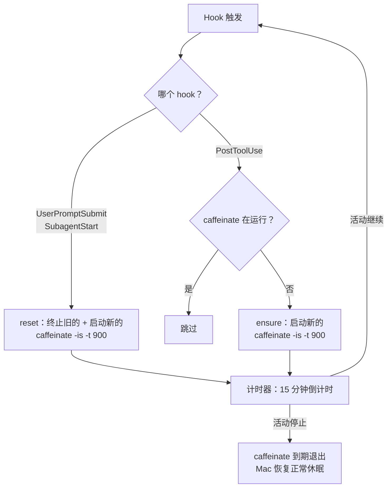
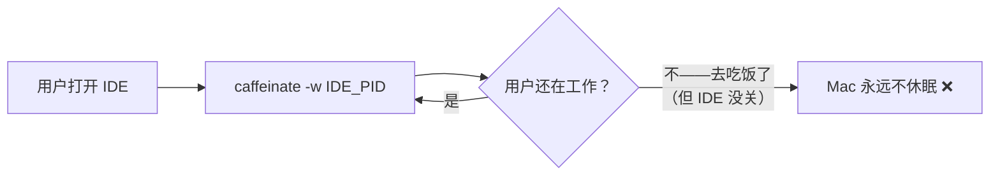
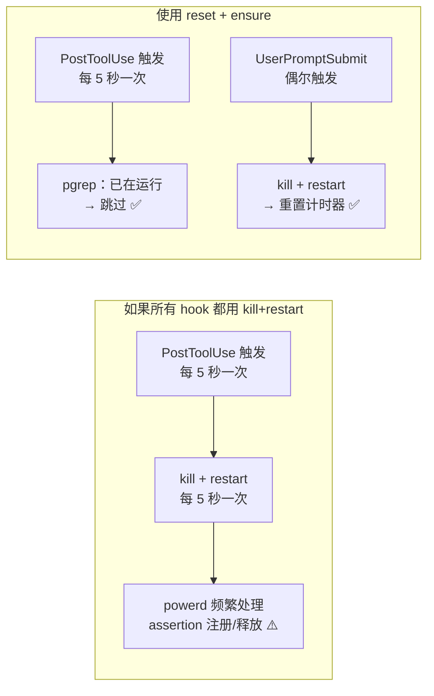
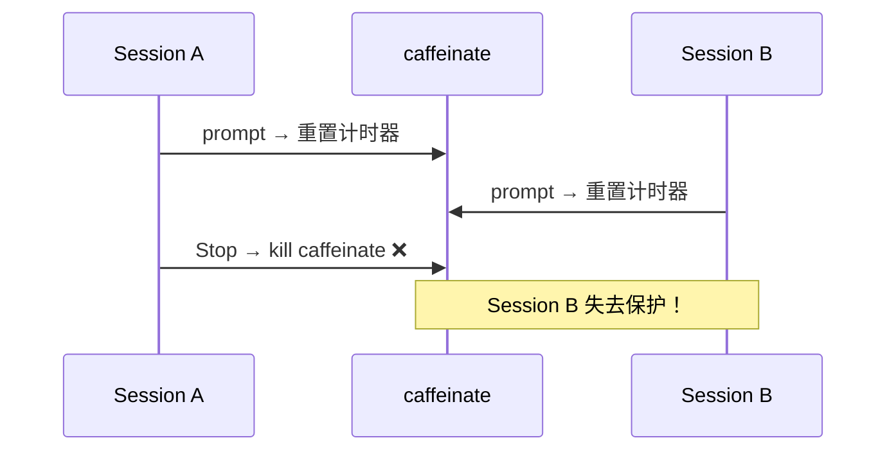

[English](README.md) | 中文

# sip

在 AI 编码工具工作期间保持 Mac 清醒。☕

基于 macOS 原生 [`caffeinate`](https://ss64.com/mac/caffeinate.html) 命令，为 AI 编码工具（Claude Code / Cursor / CodeBuddy 等）提供自动防休眠保护。每次 hook 触发相当于"啜一口咖啡"——重置 15 分钟的 caffeinate 计时器。当活动停止后，Mac 自动恢复正常休眠。

## 为什么需要

Mac 进入休眠后，**网络连接会断开**（Wi-Fi 关闭、TCP 连接中断），导致：
- AI 工具会话**中断**
- 长程任务（多步重构、并行 agent）**中途失败**

`caffeinate -is` 创建两个 power assertion：

| Assertion | 作用 | 参数 |
|---|---|---|
| `PreventUserIdleSystemSleep` | 阻止空闲休眠 | `-i`（电池和 AC 均有效） |
| `PreventSystemSleep` | 阻止系统休眠 | `-s`（仅 AC 有效） |

**不会阻止息屏**——显示器仍按系统设置正常关闭。实现"息屏不休眠"。

## 工作原理



### 两种 hook 策略

| 策略 | Hook | 行为 | 原因 |
|---|---|---|---|
| **reset** | `UserPromptSubmit`、`SubagentStart` | 终止旧的 + 启动新的 | 低频。每次用户 prompt 重置 15 分钟计时器。 |
| **ensure** | `PostToolUse` | 没有才启动，有就跳过 | 高频（每次工具调用都触发）。避免频繁 kill 进程，同时保证覆盖。 |

这意味着：
- **用户持续对话** → `UserPromptSubmit` 每次重置计时器
- **AI 执行 45 分钟长任务** → `PostToolUse` 保证 caffeinate 始终存在（到期后下次工具调用立即重启）
- **所有活动停止** → 15 分钟后计时器到期，Mac 恢复休眠

## 前置条件

- macOS（使用原生 `caffeinate`）
- [`jq`](https://jqlang.org/)（仅安装/卸载时需要，`brew install jq`）
- 支持 hook 的 AI 编码工具（如 [Claude Code](https://docs.anthropic.com/en/docs/claude-code)）

## 快速开始

**一行安装**（推荐）：

```bash
curl -fsSL https://raw.githubusercontent.com/wangyjstart/sip/main/sip.sh -o ~/.local/bin/sip.sh \
  && chmod +x ~/.local/bin/sip.sh \
  && ~/.local/bin/sip.sh install
```

或克隆安装：

```bash
git clone https://github.com/wangyjstart/sip.git && cd sip
./sip.sh install
```

重启 IDE 即可生效。

> **说明：** 这是 [tivnantu/sip](https://github.com/tivnantu/sip) 的个人 fork，新增了
> Codex 原生支持。若用原版（无 Codex 支持），将地址换成 `tivnantu/sip`。

## 使用方式

```bash
sip.sh              # reset 模式：终止旧的 + 启动新的（重置计时器）
sip.sh ensure       # ensure 模式：没有才启动（幂等）
sip.sh status       # 查看安装状态和运行状态
sip.sh stop         # 手动停止 caffeinate
sip.sh install      # 安装脚本并注册 hook（自动检测 IDE）
sip.sh install --ide cursor   # 安装到指定 IDE
sip.sh install --ide codex     # 安装到 Codex（写入 ~/.codex/hooks.json）
sip.sh uninstall    # 移除 hook、停止 caffeinate、删除脚本
sip.sh --help       # 帮助
```

### 支持的 IDE

默认：自动检测（优先选择已有配置目录的 IDE，兜底为 claude）。使用 `--ide` 显式指定。

| IDE | `--ide` 值 |
|---|---|
| [Claude Code](https://docs.anthropic.com/en/docs/claude-code) | `claude`（兜底） |
| [CodeBuddy](https://www.codebuddy.ai/) | `codebuddy` |
| [Cursor](https://cursor.com/) | `cursor` |
| [Cline](https://docs.cline.bot/) | `cline` |
| [Augment](https://www.augmentcode.com/) | `augment` |
| [Windsurf](https://docs.windsurf.com/) | `windsurf` |
| [Codex](https://www.codex-docs.com/) | `codex` |

> **Codex 说明：** hooks 写入 `~/.codex/hooks.json`（不是 `settings.json`）。
> Codex 要求非托管 hook 信任一次——安装后在 Codex 中运行 `/hooks`，
> 批准 sip hook（绑定到当前 hash；命令变更后需重新信任）。

## 配置

通过环境变量覆盖超时时间（单位：秒）：

```bash
export SIP_TIMEOUT=1800  # 改为 30 分钟（默认 900 = 15 分钟）
```

## 设计决策

### 为什么用 `caffeinate` 而不是自定义方案？

`caffeinate` 是 macOS 原生工具，通过内核级 power assertion 阻止休眠。这是 Apple 官方提供的正确方式——无 hack、无变通、无第三方依赖。

### 为什么不用 `-w` 绑定进程？

`caffeinate -w <pid>` 在目标进程存活期间持续防休眠。



问题：
- 用户开着 IDE 去吃饭/下班 → Mac 永远不休眠，浪费电
- 不同 IDE 进程模型不同 → 绑定策略无法通用

基于超时的方案更符合"防止**任务期间**休眠"的初衷。

### 为什么用两种策略（reset vs ensure）？



- **全部 kill+restart**：`PostToolUse` 每次工具调用都触发（密集工作时可能每几秒一次）。频繁 kill/restart caffeinate 意味着 `powerd` 需要反复注册/释放 power assertion——浪费。
- **reset + ensure**：只有用户 prompt 和子 agent 启动（低频）才重置计时器。工具调用只检查"在跑吗？"——一次 `pgrep`，几乎零开销。

### 为什么不用 Stop hook？

`Stop` 在对话轮次结束时触发。多会话场景下：



15 分钟超时是安全的兜底机制，避免跨会话冲突。

### 为什么是 15 分钟？

有了 `PostToolUse` 在活跃工作期间持续保障，超时只是**活动停止后的兜底**。15 分钟：
- 足够长：macOS 不会瞬间休眠——总有一个宽限期
- 足够短：相比 30 或 60 分钟不会浪费太多电
- 可配置：`SIP_TIMEOUT=1800` 即可改为 30 分钟

## 边界场景

| 场景 | 行为 |
|---|---|
| 多个 session / agent 并发 | 任何 `UserPromptSubmit` 重置计时器；`PostToolUse` 保证覆盖 |
| 用户停止操作 | 最后一次 prompt 后 15 分钟过期 |
| 长任务（45 分钟，无新 prompt） | `PostToolUse` 保证 caffeinate 持续存活；若到期，下次工具调用立即重启 |
| caffeinate 被外部 kill | 下次 hook 触发自动启动新的 |
| 用户想立即休眠 | `sip.sh stop` 或直接合盖 |
| 仅电池供电 | `-i` 仍防空闲休眠；`-s` 被 macOS 自动忽略 |
| 1000 次 prompt | 始终只有 1 个 caffeinate 进程 |
| 高频工具调用（每 5 秒） | `ensure` 模式：仅 `pgrep` 检查，无进程抖动 |

## 调试

```bash
# 查看 sip 状态
sip.sh status

# 查看系统所有 power assertion
pmset -g assertions

# 检查 hook 注册（以 Claude Code 为例）
cat ~/.claude/settings.json | jq '.hooks'
```

## 文件说明

```
sip/
├── sip.sh            # 唯一脚本 — hook、install、status、stop
├── README.md         # English
├── README.zh-CN.md   # 中文
└── LICENSE
```

安装后（自动检测 IDE，其他 IDE 使用 `--ide` 指定）：
```
~/.local/bin/sip.sh               # 运行时位置
~/.claude/settings.json           # 注册 3 个 hook
```

## License

[MIT](LICENSE)
